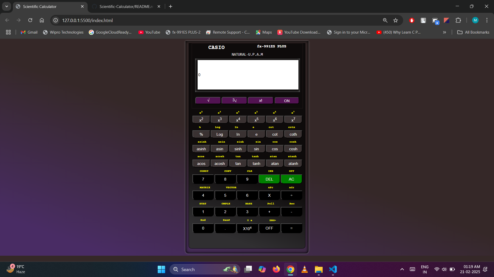
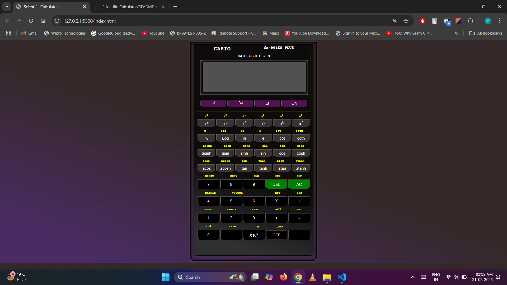

# Scientific-Calculator

This project is a fully functional **Scientific Calculator** developed using **HTML, CSS, and JavaScript**. The calculator is designed to perform basic arithmetic and advanced scientific operations. It features an intuitive interface similar to a physical scientific calculator (CASIO fx-991ES PLUS) and works across devices, including desktops, tablets, and phones.  

## 🚀 Features  
✅ Basic arithmetic operations (+, -, ×, ÷)  
🧮 Advanced functions: logarithms, trigonometry, exponents, factorial, square roots, and more  
🔢 On/Off button functionality to simulate real calculator usage  
📱 Fully responsive design for use on mobile, tablet, and desktop  
💻 User-friendly interface inspired by real scientific calculators  

## 🛠️ Technologies Used  
- **HTML**: Structure of the calculator  
- **CSS**: Styling and responsive layout  
- **JavaScript**: Functionality and calculations  

## 🌐 Live Link  
🔗 Click here to use the [Scientific Calculator](https://muskanpriyasingh.github.io/Scientific-Calculator/) 🚀

## 📷 Screenshot

*Calculator turned ON*

*Calculator turned OFF*

## 🤝 Contributing
Contributions are welcome! Feel free to fork the repo and submit pull requests.

